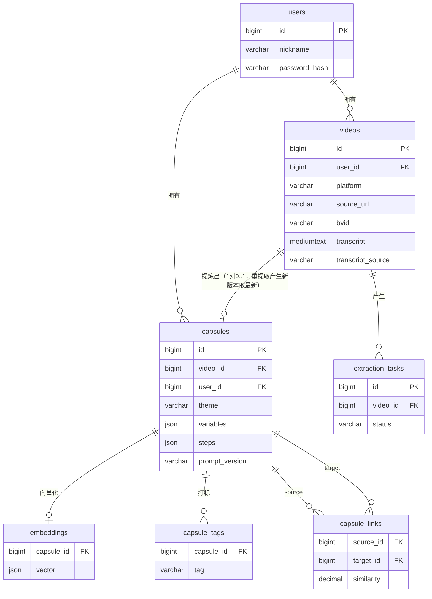

# DATABASE.md — 数据库设计文档

## 文档信息

| 项 | 内容 |
| --- | --- |
| 项目名 | 影海拾光——视频平台知识胶囊提取系统 |
| 文档版本 | v0.1 |
| 创建时间 | 2026-08-28 |
| 负责人 | 刘郁鹏 |
| 状态 | 草稿 |

> 上游输入：TECHNICAL_DESIGN.md 已定稿——任务状态机（pending→resolving→transcribing→extracting→done/failed）、转写来源 transcript_source、垂类路由、向量化与建边方案、行级数据隔离。数据库：MySQL 8.0，字符集 utf8mb4 / utf8mb4_unicode_ci。

---

## 1. 数据模型概览

### 1.1 ER 图

### 1.2 实体清单与关系

| 实体 | 说明 | 关系 |
| --- | --- | --- |
| users | 用户（M1 仅 1 条种子用户） | 1:N videos, capsules |
| videos | 解析出的视频/手动文案条目，持有转写文本 | 1:N extraction_tasks；1:0..1 capsules（当前生效胶囊） |
| extraction_tasks | 提取任务，记录状态机流转与错误 | N:1 videos |
| capsules | 知识胶囊（结构化产出） | 1:1 embeddings；1:N capsule_tags；N:N capsule_links（经 source/target） |
| capsule_tags | 标签冗余表，用于标签筛选查询 | N:1 capsules |
| embeddings | 向量存储（JSON 数组） | 1:1 capsules |
| capsule_links | 语义关系边（有向，双向冗余存储） | N:N capsules |

## 2. 表结构设计

### 2.0 通用字段约定

所有表包含：`id BIGINT UNSIGNED AUTO_INCREMENT PRIMARY KEY`、`created_at DATETIME NOT NULL DEFAULT CURRENT_TIMESTAMP`、`updated_at DATETIME NOT NULL DEFAULT CURRENT_TIMESTAMP ON UPDATE CURRENT_TIMESTAMP`。需要软删的表加 `deleted_at DATETIME NULL`（软删业务：胶囊与视频的删除）。

### 2.1 users — 用户

| 字段 | 类型 | 空 | 默认 | 键 | 说明 |
| --- | --- | --- | --- | --- | --- |
| id | BIGINT UNSIGNED | 否 | 自增 | PK | |
| nickname | VARCHAR(64) | 否 | | | 昵称 |
| phone | VARCHAR(20) | 是 | NULL | | 手机号（M3 登录用） |
| password_hash | VARCHAR(255) | 是 | NULL | | bcrypt 哈希；M1 单用户模式可为空 |
| created_at / updated_at | DATETIME | 否 | | | 通用字段 |

约束：`UNIQUE KEY uk_phone (phone)`（非空时唯一）。

### 2.2 videos — 视频/文案条目

| 字段 | 类型 | 空 | 默认 | 键 | 说明 |
| --- | --- | --- | --- | --- | --- |
| id | BIGINT UNSIGNED | 否 | 自增 | PK | |
| user_id | BIGINT UNSIGNED | 否 | | FK→users.id | 行级隔离依据 |
| platform | VARCHAR(16) | 否 | | | `bilibili` / `douyin` / `manual` |
| source_url | VARCHAR(512) | 是 | NULL | | 原始链接；manual 为 NULL |
| bvid | VARCHAR(32) | 是 | NULL | | B 站 BV 号 |
| title | VARCHAR(256) | 是 | NULL | | 标题（resolver 抓取或手动输入） |
| cover_url | VARCHAR(512) | 是 | NULL | | 封面 |
| duration_sec | INT UNSIGNED | 是 | NULL | | 视频时长 |
| transcript | MEDIUMTEXT | 是 | NULL | | 转写文本（≤16MB，1–10min 视频足够） |
| transcript_source | VARCHAR(16) | 是 | NULL | | `subtitle_api` / `asr` / `manual`；NULL=尚未转写 |
| deleted_at | DATETIME | 是 | NULL | | 软删 |

索引：
- `uk_user_source (user_id, platform, source_url(191))` — 幂等去重：同一用户重复分享不重复建条目（前缀索引 191 兼容 utf8mb4 最大键长）
- `idx_user_created (user_id, created_at)` — 列表按时间倒序查询
- `idx_bvid (bvid)` — 运维排查按 BV 号定位

### 2.3 extraction_tasks — 提取任务

| 字段 | 类型 | 空 | 默认 | 键 | 说明 |
| --- | --- | --- | --- | --- | --- |
| id | BIGINT UNSIGNED | 否 | 自增 | PK | 内部主键；对外 task_id 为字符串 `{YYYYMMDDHHMMSS}_{id 零填充6位}`（如 `20260828120000_000042`），与 API.md 示例一致，由应用层生成 |
| video_id | BIGINT UNSIGNED | 否 | | FK→videos.id | |
| user_id | BIGINT UNSIGNED | 否 | | FK→users.id | 冗余，任务查询免 JOIN |
| status | VARCHAR(16) | 否 | `pending` | | `pending`/`resolving`/`transcribing`/`extracting`/`done`/`failed` |
| stage_error | VARCHAR(512) | 是 | NULL | | 失败阶段与原因（如 `transcribing: ASR unavailable`） |
| retry_count | TINYINT UNSIGNED | 否 | 0 | | LLM 重试计数 |
| raw_llm_output | MEDIUMTEXT | 是 | NULL | | LLM 原始输出（排查格式漂移） |

索引：
- `idx_video (video_id)` — 按视频查任务历史
- `idx_user_status (user_id, status, updated_at)` — App 轮询"我进行中的任务"
- `idx_status_updated (status, updated_at)` — 服务重启后扫描中间态任务标 failed

### 2.4 capsules — 知识胶囊

| 字段 | 类型 | 空 | 默认 | 键 | 说明 |
| --- | --- | --- | --- | --- | --- |
| id | BIGINT UNSIGNED | 否 | 自增 | PK | |
| video_id | BIGINT UNSIGNED | 否 | | FK→videos.id, UNIQUE | 一个视频当前生效一个胶囊（重提取覆盖更新） |
| user_id | BIGINT UNSIGNED | 否 | | FK→users.id | 冗余，行级隔离 |
| theme | VARCHAR(256) | 否 | | | 核心主题 |
| variables | JSON | 否 | `[]` | | 关键变量数组 |
| steps | JSON | 否 | `[]` | | 步骤清单数组 |
| category | VARCHAR(16) | 否 | | | 垂类 `step`/`config`/`theory` |
| tags | JSON | 否 | `[]` | | 标签数组（展示用，筛选走 capsule_tags） |
| model | VARCHAR(64) | 否 | | | 提取模型名，如 `qwen-plus` |
| prompt_version | VARCHAR(16) | 否 | | | Prompt 模板版本，如 `step-v3` |
| source_text_digest | CHAR(64) | 否 | | | 提取时转写文本 SHA-256，判断转写是否变化需重提取 |
| deleted_at | DATETIME | 是 | NULL | | 软删 |

索引：
- `uk_video (video_id)` — 1:0..1 约束
- `idx_user_created (user_id, created_at)` — 胶囊流时间倒序
- `idx_user_category (user_id, category)` — 图谱按垂类过滤

### 2.5 capsule_tags — 标签（筛选用冗余表）

| 字段 | 类型 | 空 | 键 | 说明 |
| --- | --- | --- | --- | --- |
| capsule_id | BIGINT UNSIGNED | 否 | FK→capsules.id, 联合 PK | 随胶囊重写（delete+insert） |
| tag | VARCHAR(64) | 否 | 联合 PK | 小写归一化后的标签 |

索引：`PK (tag, capsule_id)` 顺序 — `WHERE tag = ?` 筛选走最左前缀；写入时与 JSON tags 同事务保持一致。

### 2.6 embeddings — 向量

| 字段 | 类型 | 空 | 默认 | 键 | 说明 |
| --- | --- | --- | --- | --- | --- |
| capsule_id | BIGINT UNSIGNED | 否 | | PK, FK→capsules.id | 1:1 |
| vector | JSON | 否 | | | 1024 维 float 数组（text-embedding-v3） |
| model | VARCHAR(64) | 否 | | | 嵌入模型名，换模型后需全量重算 |
| dim | SMALLINT UNSIGNED | 否 | 1024 | | 维度校验 |

说明：数据量（≤ 数千条）下全量载入 numpy 算余弦 < 50ms，JSON 列 + 内存计算即可；> 10 万条再迁 pgvector（见技术设计备选）。

### 2.7 capsule_links — 语义关系边

| 字段 | 类型 | 空 | 键 | 说明 |
| --- | --- | --- | --- | --- |
| id | BIGINT UNSIGNED | 否 | PK | |
| source_id | BIGINT UNSIGNED | 否 | FK→capsules.id | 较新胶囊为 source（建边方向约定） |
| target_id | BIGINT UNSIGNED | 否 | FK→capsules.id | |
| similarity | DECIMAL(5,4) | 否 | | 余弦相似度 0~1，阈值默认 0.75 |

索引：
- `uk_edge (source_id, target_id)` — 防重复建边
- `idx_target (target_id)` — 删除胶囊时清理相邻边

## 3. 索引设计汇总

| 索引 | 创建依据（查询场景） |
| --- | --- |
| videos.uk_user_source | 分享幂等去重（resolver 查重） |
| videos.idx_user_created / capsules.idx_user_created | App 与 H5 列表页"按时间倒序+分页" |
| extraction_tasks.idx_user_status | App 轮询进行中任务（悬浮卡片刷新） |
| extraction_tasks.idx_status_updated | 后端重启扫描中间态任务 |
| capsules.idx_user_category | 图谱页按垂类过滤节点 |
| capsule_tags PK(tag, capsule_id) | 标签筛选（PRD A4/C2） |
| capsule_links.uk_edge / idx_target | 建边幂等 + 删胶囊清边 |

无依据索引一律不建；新增索引必须在 PR 中写明查询场景。

## 4. 数据一致性策略

- **事务边界**：任务完成落库为单一事务——`UPDATE extraction_tasks SET status='done'` + `UPSERT capsules` + `DELETE+INSERT capsule_tags` + `UPSERT embeddings` 同提交；建边事务独立（允许延迟最终一致，图谱 60s 内可见即可）。
- **外键 vs 应用层约束**：保留外键（团队小、写入量低，数据库兜底防脏数据）；`capsule_links` 的删除清理由应用层在软删胶囊时执行（外键不做级联软删）。
- **软删**：capsules/videos 用 `deleted_at`；所有查询默认 `WHERE deleted_at IS NULL`（SQLAlchemy 统一 filter）。任务表不软删。
- **幂等**：① resolver 按 uk_user_source 查重；② 建边按 uk_edge 幂等；③ 同一 video 重复提取走"更新覆盖"而非新建（capsules.uk_video）。
- **重试一致性**：手动文案重试 = 更新 videos.transcript（transcript_source='manual'）+ 新建 task；胶囊随新任务覆盖。
- **中间态自愈**：服务重启时将 `resolving/transcribing/extracting` 中超过 10 分钟未更新的任务置 failed（stage_error='interrupted'），用户可重试。

## 5. 缓存与冗余

- 冗余字段：extraction_tasks.user_id、capsules.user_id（免 JOIN 的行级隔离查询）；
- M4 引入 Redis：胶囊详情（TTL 5min）、图谱 nodes/edges（写穿失效）；缓存失效以胶囊 updated_at 为版本号。

## 6. 数据迁移与版本管理

- 工具：Alembic；迁移文件命名 `<yyyymmdd_HHMM>_<slug>.py`，与 PR 绑定提交；
- 流程：改 `models/` → `alembic revision --autogenerate` → 人工核对 diff → `alembic upgrade head`；
- 种子数据：`alembic/data/seed.py` 初始化 M1 单用户（nickname=dev）与默认配置；评测样本不进种子（放 tests fixtures）；
- 禁止手改生产库结构；所有结构变更必须走迁移并在文档记录。

---

> 遗留待确认项：① 重提取是否保留历史胶囊版本（当前设计为覆盖，如需"版本对比"加 capsules.parent_id）；② embedding JSON 列的容量上限确认（2000 胶囊 ≈ 8MB，无压力）。
