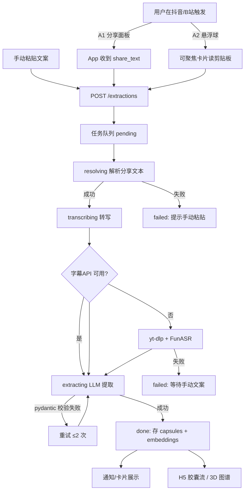
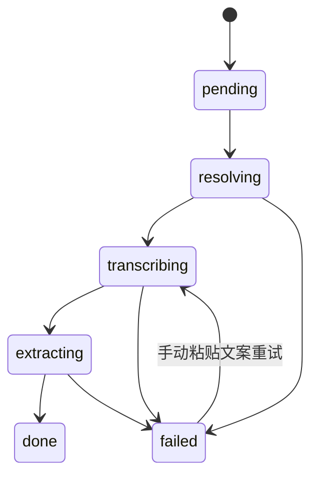

# PRD.md — 产品需求文档

## 文档信息

| 项 | 内容 |
| --- | --- |
| 项目名 | 影海拾光——视频平台知识胶囊提取系统 |
| 文档版本 | v0.1 |
| 创建时间 | 2026-08-28 |
| 负责人 | 刘郁鹏（产品统筹） |
| 状态 | 草稿 |

---

## 1. 项目背景与目标

### 1.1 要解决的问题

- 泛知识短视频（B站、抖音）已成为大学生获取干货的核心渠道，但流媒体的线性、碎片化形态导致内容无法直接摘录，平台"收藏"只是 URL 层面的物理归档；
- 用户收藏后因"蔡加尼克效应"产生"已掌握"的代偿心理而终止深度学习，即"收藏即吃灰"；
- 现有 AIGC 视频总结工具只做中长视频全局摘要，对 1–3 分钟高密度口语化短视频（装机清单、解题步骤等）无法剥离核心变量。

### 1.2 一句话价值主张

把单向视频流变成可编辑、可重构、可语义关联的结构化"知识胶囊"，将机械性收藏转化为结构化留存。

### 1.3 可量化的成功指标

| 指标 | 目标值 | 验证方式 |
| --- | --- | --- |
| 悬浮球唤醒响应时间 | < 500ms | 真机埋点 |
| AI 提取成功率（产出合法胶囊） | ≥ 90% | 200 条样本评测集 |
| 胶囊 JSON 格式合法率 | ≥ 90% | 评测集统计 |
| B站字幕链路端到端耗时 | ≤ 15s | 接口测试 |
| ASR 链路端到端耗时（3 分钟视频） | ≤ 60s | 接口测试 |
| 校内封闭 Beta 规模 | ≥ 100 人 | 测试报名记录 |
| 软件著作权 | 1–2 项 | 受理通知书 |

## 2. 目标用户与使用场景

### 2.1 用户画像

| 角色 | 特征 | 痛点 | 诉求 |
| --- | --- | --- | --- |
| 大学生（核心） | 18–24 岁，重度短视频使用者，备考/技能学习 | 收藏后不再回看，碎片知识无法成体系 | 低摩擦地把视频干货存成结构化笔记并串成路线 |
| 职场新人（次核心） | 用短视频学软件操作、装机配置 | 步骤类内容看完就忘 | 随时可调取"步骤清单"照做 |

### 2.2 典型使用场景

- **S1 即时采集**：大学生在 B 站刷到 Excel 技巧视频 → 想在心流高峰把步骤定格 → 点分享选"影海拾光"，30 秒内得到步骤清单胶囊。
- **S2 悬浮球采集**：用户在抖音看装机视频 → 不想跳出当前 App → 点桌面悬浮球，自动读取剪贴板分享口令完成提取。
- **S3 复习串联**：备考学生想把几十个零散的专业课视频串成复习路线 → 在 H5 端打开 3D 知识图谱，沿语义连结逐个复习。
- **S4 整理编辑**：用户在电脑端想修正 AI 提取偏差、补标签 → 打开 H5 管理端编辑胶囊。

## 3. 范围边界

### 3.1 本期做（In Scope）

- Android App（Android 10+）：系统分享接收、悬浮球采集、提取结果卡片、胶囊列表/详情/编辑；
- FastAPI 后端：分享文本解析、三级降级转写链、LLM 胶囊提取、胶囊 CRUD、语义关联与图谱数据、异步任务队列；
- Vue3 H5 管理端：登录、胶囊流、标签筛选、编辑、3D 知识图谱；
- 视频平台：B 站为主验证通道，抖音为尽力通道（失败可降级手动粘贴）。

### 3.2 本期不做（Out of Scope）

- iOS 客户端、微信小程序；
- 本地模型微调（Fine-tuning）；
- 平台私有协议逆向（只走公开接口/官方分享口令）；
- 无人工触发的后台持续监听采集（所有提取均由用户主动触发）；
- 多人协作空间、知识分享社区。

### 3.3 后续规划

- 前置摄像头隔空手势识别多模态交互（申报书储备方向，本期仅预研）；
- 桌面端（浏览器扩展）；开放 API。

## 4. 功能需求清单

### 模块 A：Android 采集端

| 编号 | 功能名 | 优先级 | 描述 | 验收标准 |
| --- | --- | --- | --- | --- |
| A1 | 系统分享接收 | P0 | 注册 `ACTION_SEND text/plain` 分享目标，接收抖音/B站分享文本并自动发起提取 | 在 B 站/抖音点"分享→影海拾光"，到任务提交成功 ≤ 3s |
| A2 | 悬浮球 | P0 | 桌面悬浮小球常驻（`SYSTEM_ALERT_WINDOW` + 前台服务），支持拖拽、单击展开；展开的可聚焦卡片自动读剪贴板口令并提交 | 点击悬浮球到任务提交 ≤ 2s；悬浮窗不抢夺原 App 焦点（收起态）；拖拽后位置记忆 |
| A3 | 提取结果卡片 | P0 | 任务完成后以通知/悬浮卡片展示胶囊摘要（主题+步骤数+标签），支持一键保存与跳转详情 | 成功后 ≤ 5s 收到通知；卡片字段完整 |
| A4 | 胶囊列表/详情 | P0 | 按时间倒序浏览，支持标签筛选；详情含核心主题、关键变量、步骤清单、原文链接 | 列表加载 ≤ 1s（50 条内）；详情字段与后端数据一致 |
| A5 | 胶囊编辑 | P1 | 编辑主题、步骤、标签并保存 | 保存后列表/详情即时刷新 |
| A6 | 登录 | P1 | 账号密码登录（M3 起） | 未登录无法访问私有数据 |
| A7 | 音频捕获通道 | P2 | MediaProjection 捕获正在播放的音频流转写并提取（创新通道） | B 站播放中触发，产出完整转写并完成提取；每次触发有系统授权弹窗 |

### 模块 B：后端服务

| 编号 | 功能名 | 优先级 | 描述 | 验收标准 |
| --- | --- | --- | --- | --- |
| B1 | 分享文本解析 | P0 | 从分享口令/短链提取平台与视频地址；B 站解析出 BV 号与元数据（标题/封面/时长） | 5 种真实口令样本全部解析成功；无法解析返回明确错误码 |
| B2 | 转写服务 | P0 | 默认全走本地 ASR（yt-dlp 抽音频 + FunASR）；B站字幕接口为可选通道（默认关闭）；失败报错待手动粘贴 | 转写成功记录 transcript_source；全失败返回 2002 |
| B3 | LLM 胶囊提取 | P0 | qwen-plus，Few-Shot+思维链，按垂类（步骤型/数值型/理论型）路由模板，pydantic 校验 `{核心主题, 关键变量[], 步骤清单[], 标签[]}`，失败重试 ≤ 2 次 | 200 条评测集：提取成功率 ≥ 90%，JSON 合法率 ≥ 90% |
| B4 | 胶囊 CRUD | P0 | 列表（分页/标签筛选/关键词）、详情、编辑、软删除 | 全部接口有接口测试覆盖 |
| B5 | 手动通道 | P0 | 直接粘贴视频文案提交提取（文案 ≤ 5000 字） | 手动文案可完成提取并入库 |
| B6 | 异步任务队列 | P0 | 提取任务状态机 `pending → resolving → transcribing → extracting → done / failed`，可查询进度 | 状态每次变更可被任务查询接口观测 |
| B7 | 语义关联 | P1 | 通义 text-embedding-v3 向量化，余弦相似度 ≥ 阈值（默认 0.75）自动建边 | 新胶囊入库后 60s 内出现在图谱关系中 |
| B8 | 图谱数据 | P1 | 输出节点（胶囊）与边（语义关系）供 3D 渲染 | 节点/边字段满足前端渲染所需 |
| B9 | 用户鉴权 | P1 | M1 单用户固定 token；M3 完整登录态（JWT） | 未携带 token 返回 1002 |

### 模块 C：H5 管理端

| 编号 | 功能名 | 优先级 | 描述 | 验收标准 |
| --- | --- | --- | --- | --- |
| C1 | 登录 | P1 | 账号登录，token 管理 | 登录态 7 天内有效 |
| C2 | 胶囊流 | P0 | 分页列表、标签筛选、关键词搜索、编辑、删除 | 与后端接口字段一一对应 |
| C3 | 3D 知识图谱 | P1 | 3d-force-graph 渲染节点/边；节点可拖拽、缩放、点击下钻到胶囊详情 | 100 节点渲染帧率 ≥ 30fps；点击节点 1s 内打开详情 |

## 5. 核心用户故事 / 用例

- **US-1**（主流程）作为大学生，我希望在 B 站分享视频后 30 秒内得到步骤清单胶囊，以便直接照做而不用重看视频。
- **US-2**（异常流-解析失败）作为用户，当分享口令无法解析时，我希望 App 提示我手动粘贴文案，以便仍能完成提取。
- **US-3**（异常流-转写失败）作为用户，当视频既无字幕又转写失败时，我希望收到明确原因提示，而不是无限等待。
- **US-4**（异常流-悬浮球误触）作为用户，当我点悬浮球但剪贴板没有有效口令时，我希望看到引导"先在视频 App 点分享-复制链接"。
- **US-5**（图谱）作为备考学生，我希望图谱自动把同一门课的零散视频连成路线，以便按连结顺序复习。
- **US-6**（权限边界）作为未登录用户，我无法看到任何已有胶囊数据。

## 6. 业务流程图

### 6.1 主流程（提取闭环）

### 6.2 提取任务状态机

## 7. 非功能需求

| 类别 | 要求 |
| --- | --- |
| 性能 | 悬浮唤醒 < 500ms；B站字幕链路端到端 ≤ 15s；ASR 链路（3min 视频）≤ 60s；50 并发下任务查询接口 P95 ≤ 500ms（JMeter） |
| 安全 | 全接口鉴权（M1 单用户 token，M3 JWT）；用户数据行级隔离；SESSDATA/DashScope Key 仅存服务端配置，不进日志、不下发客户端；视频文案仅用于当次提取 |
| 可用性 | 转写三级降级自动切换；失败任务支持手动重试；后端异常返回结构化错误码 |
| 可维护性 | Prompt 模板版本化管理（prompt_version 可追溯）；转写/提取服务可独立替换实现 |
| 兼容性 | Android 10–15；H5 兼容 Chrome/Safari 移动端及主流桌面浏览器 |

## 8. 验收标准总表（完成定义）

| 编号 | 验收项 | 对应功能 | 判定方式 |
| --- | --- | --- | --- |
| AC-01 | B 站视频"分享→拿到胶囊"端到端 ≤ 30s | A1/B1/B2/B3 | 真机演示 + 接口计时 |
| AC-02 | 悬浮球点击到提交 ≤ 2s，唤醒 < 500ms | A2 | 真机埋点 |
| AC-03 | 200 条评测集提取成功率 ≥ 90% 且 JSON 合法率 ≥ 90% | B3 | 评测脚本报告 |
| AC-04 | 无字幕视频自动降级 ASR 并成功提取 | B2 | 接口测试（构造无字幕样本） |
| AC-05 | 全降级失败时用户收到明确指引并能走手动通道 | B2/B5 | 真机用例 |
| AC-06 | 胶囊可编辑、可筛选、可软删除 | A4/A5/C2 | 接口 + UI 测试 |
| AC-07 | 100 节点 3D 图谱 ≥ 30fps、可下钻详情 | B8/C3 | 性能面板实测 |
| AC-08 | 未登录访问任何数据接口返回 1002 | B9 | 接口测试 |
| AC-09 | 50 并发压测下任务查询 P95 ≤ 500ms | B6 | JMeter 报告 |
| AC-10 | 软著受理 1–2 项 | 全部 | 受理通知书 |

---

> 遗留待确认项：① Beta 百人招募与激励方式；② A6 登录是否接入学校统一身份认证（暂按账号密码设计）。
