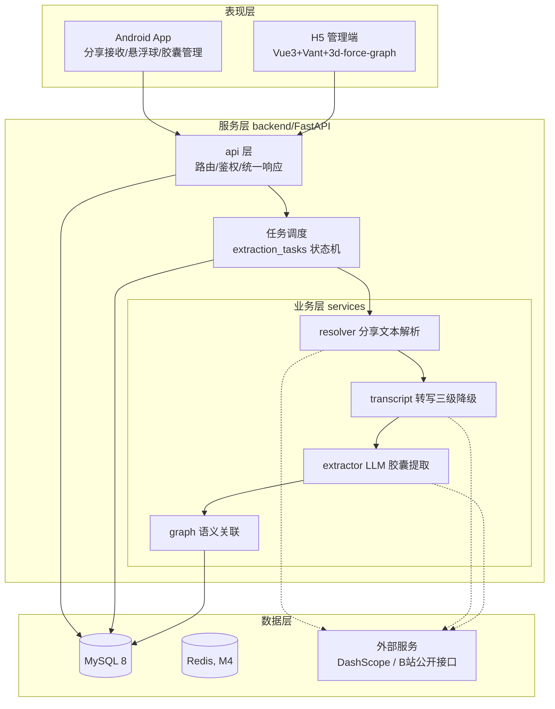
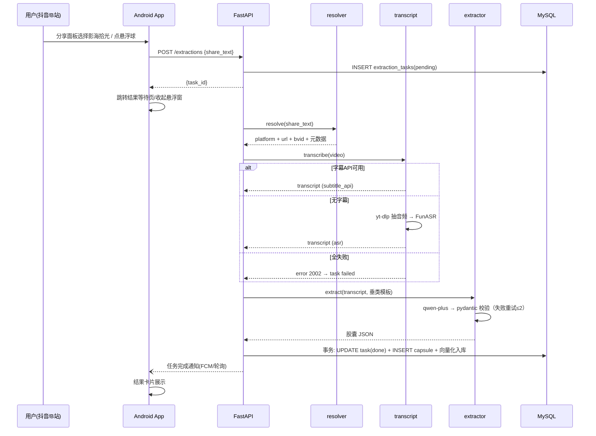

# TECHNICAL_DESIGN.md — 技术设计文档

## 文档信息

| 项 | 内容 |
| --- | --- |
| 项目名 | 影海拾光——视频平台知识胶囊提取系统 |
| 文档版本 | v0.1 |
| 创建时间 | 2026-08-28 |
| 负责人 | 刘郁鹏（架构统筹） |
| 状态 | 草稿 |

> 上游输入：PRD.md 已定稿结论——模块 A（Android 采集）/B（后端）/C（H5+图谱），P0 = 分享接收、悬浮球、转写三级降级、LLM 提取、胶囊 CRUD、手动通道、异步任务；AC 指标（唤醒<500ms、成功率≥90%、端到端≤30s 等）。

---

## 1. 技术选型

| 层 | 选型 | 理由 | 备选与取舍 |
| --- | --- | --- | --- |
| Android 客户端 | Kotlin + Jetpack Compose + Retrofit/OkHttp | 官方主推 UI 框架，悬浮窗/前台服务/分享接收均为原生能力必需 | Flutter/React Native：系统级悬浮窗与 MediaProjection 需大量平台通道代码，放弃 |
| 后端框架 | Python FastAPI | 异步原生（转写/LLM 调用均为 IO 密集）、pydantic 与 JSON Schema 校验天然契合胶囊约束、自动生成 OpenAPI 文档 | Flask（需自行拼异步与校验）、Spring Boot（团队 Java 线收益低于 Python AI 生态，砍掉） |
| LLM | 阿里云百炼 qwen-plus（OpenAI 兼容接口） | 国内合规、便宜、长上下文；中文口语化文本理解好；不做本地微调 | Kimi（备选通道，同 OpenAI 兼容）；DeepSeek（备用）；自部署开源模型：GPU 成本超出预算，否决 |
| Embedding | 通义 text-embedding-v3 | 与 qwen 同一 Key/生态，1024 维，中文效果好 | BGE 本地模型：需 GPU/大内存，数据量小收益低，作备选 |
| ASR | FunASR Paraformer-zh（本地 CPU） | 中文 SOTA 开源、CPU 上快于实时、专有名词识别优于 whisper-small | faster-whisper small/int8（备选）；商用录音文件识别 API（有费用，M4 再评估） |
| 视频获取 | yt-dlp + ffmpeg | B站支持成熟，仅用于"无字幕时抽音频"场景 | 平台客户端 API：风控强，仅作元数据兜底 |
| 数据库 | MySQL 8.0（utf8mb4） | 团队熟悉、申报书指定、JSON 列满足 embedding 存储 | PostgreSQL + pgvector（数据量 > 10万条再迁移） |
| 缓存/队列 | Redis 7（M4 引入）；M1–M3 用数据库轮询做任务队列 | 避免 MVP 复杂度；任务量小（百人内）DB 轮询足够 | Celery + RabbitMQ：MVP 期过重，Redis 发布订阅作中期升级 |
| H5 管理端 | Vue 3 + Vant 4 + Vite | 申报书既定栈，移动端组件全 | React：团队 Vue 经验更深，放弃 |
| 3D 图谱 | 3d-force-graph（Three.js 封装） | 内置 3D 力导向物理、节点拖拽/点击事件，免去手写物理引擎调参 | 原生 Three.js + d3-force-3d：工作量大；ECharts GL：下钻交互弱 |

## 2. 系统架构

### 2.1 分层架构



### 2.2 模块职责边界

| 模块 | 负责 | 不负责 |
| --- | --- | --- |
| `api` 层 | 参数校验、鉴权、统一响应封装、路由 | 任何业务逻辑 |
| `resolver` | 口令/短链 → 平台+URL+BV号+元数据 | 下载、转写 |
| `transcript` | 三级降级产出转写文本，记录 transcript_source | 判断内容质量 |
| `extractor` | 文本 → 合法知识胶囊 JSON（垂类路由+重试） | 存储、关联计算 |
| `graph` | 向量化、相似度建边、图谱数据输出 | 胶囊内容编辑 |
| Android `ShareReceiverActivity` | 接收 `ACTION_SEND`、提取 share_text、调 API | 悬浮窗 |
| Android `FloatingService` | 悬浮球渲染/拖拽/展开、聚焦读剪贴板、结果卡片 | 业务逻辑（全部委托 API） |

依赖方向：`api → services → infra`；上层可依赖下层，禁止反向；Android 与 H5 只通过 HTTP API 通信，无直连数据库。

## 3. 核心流程设计

### 3.1 提取链时序（主流程）



### 3.2 异常流与回退策略

| 故障点 | 现象 | 回退策略 |
| --- | --- | --- |
| 口令解析失败（2001） | 抖音短链风控/格式变化 | App 弹出手动粘贴入口，直接提交文案走 B5 通道 |
| 字幕 API 失效 | cookie 过期/接口变更 | 自动降级 yt-dlp+FunASR；服务端告警日志记录 |
| ASR 失败 | 下载失败/模型异常 | task 标记 failed 并附原因，支持"仅用标题+简介"低质量提取（待确认：M2 是否启用） |
| LLM 输出非法 JSON | 偶发格式漂移 | 重试 ≤2 次（附错误信息要求修正）；仍失败标记 failed，原始输出存 raw_llm_output 供排查 |
| LLM 超时/限流 | DashScope 429 | 指数退避重试 2 次 → failed；M4 引入 Redis 排队限流 |
| 悬浮球读剪贴板为空 | 用户未复制 | 引导提示"先点分享-复制链接"，不提交任务 |

## 4. 关键模块设计

### 4.1 resolver（分享文本解析）

- 入参：`share_text: str`；出参：`ResolvedVideo(platform, url, bvid?, title?, cover_url?, duration_sec?)`
- 规则：正则提取 `b23.tv` 短链 / `bilibili.com/video/BVxxx` / `v.douyin.com` 短链；短链 HEAD 跟随重定向取真实地址；B 站用公开 Web API 取元数据（需 SESSDATA）
- 幂等：按 `(user_id, platform, source_url)` 查重，重复分享返回已有 video + 最近 task

### 4.2 transcript（三级降级）

```
transcribe(video) ->
  L1 subtitle_api: B站 player/wbi/v2 字幕列表（需 SESSDATA+wbi 签名）→ 拼字幕文本
  L2 asr: yt-dlp -f bestaudio → ffmpeg 转 16k wav → FunASR paraformer-zh
  L3 manual: 抛 TranscriptUnavailable，task failed，等待用户手动文案重试
成功后记录 transcript_source ∈ {subtitle_api, asr, manual}
```

### 4.3 extractor（LLM 提取引擎）

- 垂类路由：先由 LLM 输出 `category ∈ {step, config, theory}`（与转写文本一起做轻量分类调用），再加载对应 Few-Shot 模板（`prompts/step.md` / `config.md` / `theory.md`）
- 输出约束：`response_format=json_object` + Prompt 内嵌 JSON Schema；pydantic 模型 `CapsuleSchema(theme: str, variables: list[str], steps: list[str], tags: list[str])` 校验
- 重试：校验失败把 pydantic 错误信息拼回 Prompt 重试，最多 2 次
- 版本管理：每份模板带版本号，写入 `capsules.prompt_version`，评测结果可按版本对比
- 温度：0.2（结构化任务）；max_tokens：2048

### 4.4 graph（语义关联）

- 新胶囊 `done` 后异步向量化（text-embedding-v3），vector 存 `embeddings.vector`（JSON 数组）
- 建边：与用户全部历史胶囊算余弦相似度，≥0.75 建边写入 `capsule_links`（同向下去重）；用户胶囊 ≤ 2000 条时全量内存计算（numpy），超限后只与最近 500 条计算（待确认：阈值 0.75 是否按垂类细分）
- 输出：`GET /graph` 返回 `{nodes: [{id, theme, tags, weight}], edges: [{source, target, similarity}]}`

### 4.5 Android 悬浮窗与分享接收

- `ShareReceiverActivity`：`intent-filter` 声明 `ACTION_SEND text/plain`；`onCreate` 取 `EXTRA_TEXT` → 直接调 API → 展示等待页；单任务启动模式避免重复实例
- `FloatingService`（前台服务，`foregroundServiceType="specialUse"`）：
  - 收起态：48dp 悬浮小球，`TYPE_APPLICATION_OVERLAY`、不可聚焦（不抢原 App 焦点）、可拖拽、边缘吸附、位置存 SharedPreferences
  - 展开态：点击后切 `FLAG_FOCUSABLE` 可聚焦卡片，此时才读剪贴板（Android 10+ 仅焦点窗口可读）；解析出有效口令立即提交并收回
  - 结果卡片：任务完成经轮询获知后展示 3s 自动收起，点击跳详情
- 权限引导：无"显示在其他应用上层"权限时跳系统设置页；Android 13+ 运行时申请 `POST_NOTIFICATIONS`
- 音频通道（A7，M3）：`MediaProjection` + `AudioPlaybackCapture`（Android 10+），捕获 PCM 流式切片上传后端转写；Android 14+ 前台服务类型 `mediaProjection`；用户每次触发有系统授权弹窗；抖音若禁止捕获则提示走分享通道

## 5. 非功能设计

| 项 | 方案 |
| --- | --- |
| 性能 | 转写/向量化全部异步任务化，API 只做提交与查询；M4 引 Redis 缓存胶囊详情与图谱结果（TTL 5min）；ASR 模型进程启动时常驻避免冷加载 |
| 安全 | 鉴权：M1 `Authorization: Bearer <固定token>`，M3 JWT(access 2h + refresh 7d)；数据行级隔离（所有查询带 user_id）；密钥仅存 `.env`（gitignore）；LLM 日志脱敏（不打完整文案） |
| 可扩展性 | 转写/提取/解析均为独立 service 类，接口稳定可替换；新增平台只需在 resolver/transcript 注册新 handler |
| 可靠性 | 任务幂等（重复分享不重复建胶囊）；服务重启后 `transcribing/extracting` 中间态任务自动标记 failed 可重试 |

## 6. 关键技术难点与方案

| 难点 | 问题 | 方案 | 备选 | 取舍 |
| --- | --- | --- | --- | --- |
| Android 10+ 剪贴板限制 | 后台/无焦点应用读不到剪贴板 | 悬浮球展开为可聚焦窗口后再读 | AccessibilityService 读屏（权限敏感、上架风险） | 聚焦窗口方案轻量合规，选中 |
| 抖音风控 | 短链解析/音频获取接口不稳定 | 抖音定为"尽力通道"：解析失败引导手动粘贴 | 逆向签名算法（违规，否决） | 用户价值不受阻，风险可控 |
| LLM 输出格式漂移 | 口语化输入下 JSON 偶发非法 | JSON mode + Schema 内嵌 + pydantic 重试 ≤2 + 温度 0.2 | Fine-tuning（申报书明确不做） | 评测集持续迭代 Prompt |
| 3D 图谱"视觉毛线球" | 节点密集时边交叉不可读 | 3d-force-graph 默认布局 + 按标签聚簇着色 + 阈值控制边密度 | 层次布局（实现复杂） | 先满足漫游/下钻，M4 调参 |
| 长转写超上下文 | 超长视频转写文本超限 | 本期限定 1–10 分钟短视频，超长截断并提示 | 分段 Map-Reduce 提取（后续） | 范围内不需要 |

## 7. 目录结构规划

```
backend/
├── app/
│   ├── main.py               # FastAPI 入口
│   ├── core/
│   │   ├── config.py         # pydantic-settings 配置
│   │   ├── security.py       # token / JWT
│   │   └── llm.py            # DashScope 客户端封装
│   ├── api/
│   │   ├── deps.py           # 依赖注入（当前用户/DB会话）
│   │   └── routes/           # extractions / capsules / graph / auth
│   ├── services/
│   │   ├── resolver.py
│   │   ├── transcript/
│   │   │   ├── bilibili_subtitle.py
│   │   │   ├── asr_funasr.py
│   │   │   └── pipeline.py   # 三级降级调度
│   │   ├── extractor.py
│   │   ├── embedder.py
│   │   └── graph.py
│   ├── models/               # SQLAlchemy ORM
│   ├── schemas/              # pydantic 请求/响应模型（含 CapsuleSchema）
│   └── workers/
│       └── extraction_runner.py   # 任务状态机执行器
├── prompts/                  # step.md / config.md / theory.md（带版本头）
├── tests/
├── alembic/                  # 迁移
└── requirements.txt

android/
└── app/src/main/java/com/yhsg/
    ├── ui/                   # Compose 页面（列表/详情/等待页）
    ├── service/FloatingService.kt
    ├── network/              # Retrofit 接口与 DTO
    └── data/                 # 本地缓存（SharedPreferences/DataStore）

web/
├── src/
│   ├── api/                  # axios 封装
│   ├── views/                # Login / CapsuleList / CapsuleDetail / Graph
│   └── components/
└── vite.config.js
```

## 8. 开发规范（硬性约束）

### 8.1 代码规范

- **Python**：`ruff check` + `ruff format`（等价 black）；类型注解覆盖全部 service/api 函数签名；docstring 只写"为什么"与边界条件
- **命名**：Python 模块/函数 `snake_case`，类 `PascalCase`；Kotlin 遵循官方风格（`ktlint`）；Vue 组件文件 `PascalCase.vue`
- **数据库**：表名复数 `snake_case`（users/capsules），字段 `snake_case`，禁止拼音缩写
- **API**：路径小写复数名词 `/capsules`，动作用 POST 子资源表达（`POST /extractions`）
- **注释边界**：注释解释"为什么/约束"，不复述代码；公开接口必须有中文 docstring

### 8.2 目录与分层规范

- `api 层`禁止出现业务逻辑与 ORM 查询；`services` 禁止直接引用 FastAPI Request/Response；`models` 不做业务校验（校验在 schemas）
- 前后端契约唯一来源为 `docs/API.md` + FastAPI OpenAPI，前端不得私猜字段

### 8.3 Git 规范

- 分支模型：`main`（可发布）← `dev`（集成）← `feat/<模块>-<内容>` / `fix/<内容>`；禁止直接 push main
- 提交信息：Conventional Commits，格式 `type(scope): 摘要`，type ∈ feat/fix/docs/refactor/test/chore，例：`feat(transcript): 接入B站字幕三级降级`
- 合并：PR + 至少 1 人 Code Review（团队互审）方可合入 dev；main 仅在里程碑打 tag（`v0.1.0-mvp`）

### 8.4 依赖与版本管理

- Python：`requirements.txt` 锁定精确版本（pip freeze）；Android：`libs.versions.toml`（Version Catalog）；web：`package-lock.json` 提交
- 升级策略：里程碑间不升级大版本；安全补丁随发随升

### 8.5 质量门槛（CI/合并前检查）

| 检查 | 门槛 |
| --- | --- |
| `ruff check` | 0 error |
| `pytest` | 全部通过；核心 service（resolver/extractor/transcript pipeline）行覆盖 ≥ 60% |
| `ktlint` / Android lint | 0 error |
| `eslint` + `vue-tsc`（web） | 0 error |
| API 变更 | 必须同步更新 docs/API.md，否则 PR 不予合并 |

---

> 遗留待确认项：① ASR 全失败时是否启用"标题+简介"低质量提取；② 相似度建边阈值是否按垂类细分；③ Redis 引入时任务队列是否迁移到 Celery。
